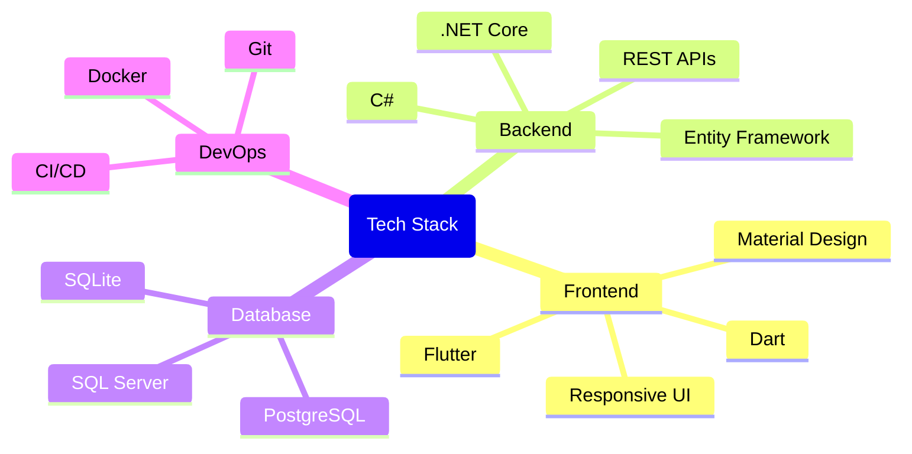

# Hello there! 👋

I'm a Fullstack Software Engineer with 3+ years of experience specializing in Flutter and .NET technologies. I'm passionate about crafting clean, maintainable, and scalable solutions while adhering to software design principles and best practices.

## 🚀 Tech Stack

### Frontend
- **Flutter/Dart** - Building cross-platform mobile applications
- Mobile app development
- State management (Provider, Bloc, etc.)
- UI/UX implementation
- Responsive design

### Backend
- **.NET Core/C#** - Developing robust backend solutions
- RESTful API design and implementation
- Database design and optimization
- Entity Framework Core

## 💡 Core Competencies

- **Architecture & Design**
  - SOLID Principles
  - Clean Architecture
  - Design Patterns
  - Domain-Driven Design (DDD)

- **Development Practices**
  - Test-Driven Development (TDD)
  - Clean Code principles
  - Agile/Scrum methodology
  - CI/CD pipelines (In-training)

## 🛠️ Tools & Technologies

## 🌟 Key Achievements

- Developed and maintained scalable fullstack applications using Flutter and .NET
- Implemented clean architecture patterns resulting in more maintainable and testable code
- Strong focus on writing clean, efficient, and well-documented code
- Experience with the complete software development lifecycle

## 📚 Continuous Learning

I'm constantly learning and staying up-to-date with the latest developments in:
- Mobile app development
- Backend architectures
- Software design patterns
- Cloud technologies

## 📫 Let's Connect!

## 📊 GitHub Stats

## 🤝 Open to Collaboration

I'm always interested in collaborating on exciting projects, especially those involving:
- Cross-platform mobile applications
- Scalable backend solutions
- Open source contributions
- Innovative tech solutions

---

💬 Feel free to reach out if you want to discuss technology, collaborations, or just want to connect!

